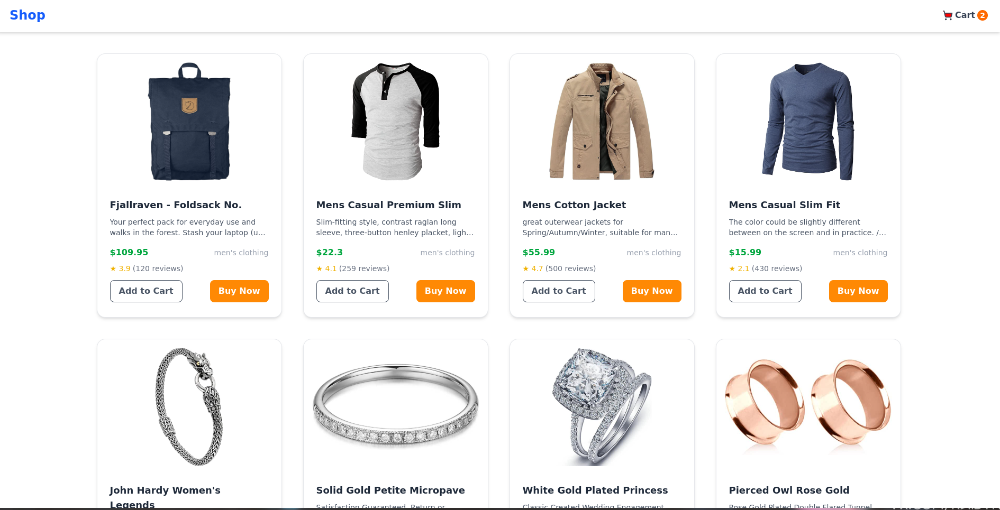

# 🛒 VC Shop

**VC Shop** is a modern and responsive e-commerce shopping cart app built with **React** and **Redux Toolkit**. This project demonstrates a simple yet powerful state management system for handling product listings, cart functionality, and quantity adjustments.

🔗 **Live Demo:** [vcshop.netlify.app](https://vcshop.netlify.app/)

---

## 🚀 Features

- ✅ Add and remove items from the cart
- 🔁 Increase or decrease item quantity
- 📦 Product listing with image, description, and category
- 🧠 State management using Redux Toolkit
- 📱 Fully responsive design
- 💡 Clean and simple UI with Tailwind CSS

---

## 🛠️ Tech Stack

- **Frontend:** React (Vite)
- **State Management:** Redux Toolkit
- **Styling:** Tailwind CSS

---

## 🧩 Getting Started

### 1. Clone the Repo

```bash
git clone https://github.com/your-username/vc-shop.git
cd vc-shop
```

### 2. Install Dependencies

```bash
npm install
```

### 3. Run Locally

```bash
npm run dev
```

---


## 📸 Screenshots

### 🏠 Home Page


### 🛒 Cart Page


---

## 💡 Future Improvements

- Add search and filter functionality
- Implement authentication
- Integrate with backend/database
- Add Stripe or Razorpay for payments


